# **Оглавление**

[Лабораторная работа №5. Повышение реалистичности изображений](#_toc101941330)

&emsp;[Текстурирование](#_toc101941331)

&emsp;&emsp;[Наложение текстуры на плоские примитивы](#_toc101941332)

&emsp;&emsp;[Наложение текстуры на объемные объекты](#_toc101941333)

&emsp;[Наложение тумана](#_toc101941334)

&emsp;&emsp;[Приложение, демонстрирующее наложение тумана](#_toc101941335)

&emsp;[Мультитекстурирование](#_toc101941336)

&emsp;&emsp;[Работа с расширениями](#_toc101941337)

&emsp;&emsp;[Разрабатываем демонстрационное приложение](#_toc101941338)

&emsp;[Практические задания](#_toc101941339)

&emsp;&emsp;[Обязательные задания](#_toc101941340)

&emsp;&emsp;[Дополнительные задания](#_toc101941341)

# <a name="_toc101941330"></a>**Лабораторная работа №5. Повышение реалистичности изображений**

## <a name="_toc101941331"></a>**Текстурирование**

Наложение текстуры на поверхность трехмерных объектов позволяет повысить их реалистичность за счет детализации поверхности цветом. OpenGL
предоставляет возможность наложения одно-, двух- и трехмерных текстур, а также кубических текстур.

### <a name="_toc101941332"></a>**Наложение текстуры на плоские примитивы**

Разработаем приложение, выполняющее загрузку растрового изображения из файла и его наложение на прямоугольник в качестве текстуры.

#### ***Инициализация GDI+***

Для загрузки изображения из файла воспользуемся возможностями библиотеки GDI+. Первым нашим шагом будет инициализация GDI+ при запуске приложения.

```cpp
#include "MyApplication.h"

class CGdiplusInitializer
{
public:
    CGdiplusInitializer()
    {
        Gdiplus::GdiplusStartupInput input;
        Gdiplus::GdiplusStartupOutput output;

        if (Gdiplus::GdiplusStartup(&m_token, &input, &output) != Gdiplus::Ok)
        {
            // Не удалось инициализировать GDI+
            throw std::runtime_error("Failed to initialize GDI+");
        }
    }

    ~CGdiplusInitializer()
    {
        Gdiplus::GdiplusShutdown(m_token);
    }
private:
    ULONG_PTR m_token;
};

CMyApplication app("Texture mapping example", 800, 600);
CGdiplusInitializer gdiplusInitializer;

int _tmain(int /*argc*/, _TCHAR* /*argv*/[])
{
    app.MainLoop();
    return 0;
}
```

#### ***Загрузка текстуры***

Следующим нашим шагом будет загрузка растрового изображения из файла. Сделать это при помощи GDI+ очень просто:

```cpp
GLuint CMyApplication::LoadTexture(std::wstring const& fileName)
{
    // Загружаем изображение при помощи GDI+
    Gdiplus::Bitmap bmp(fileName.c_str());

    if (bmp.GetLastStatus() != Gdiplus::Ok)
    {
        throw std::runtime_error("Error loading texture file");
    }
}
```

После того как изображение было загружено, необходимо получить доступ к его пикселям. Поскольку загруженное изображение может иметь или не иметь
альфа-канал, необходимо учесть это при создании текстурного объекта, загружая в него данные в формате RGBA либо RGB. Соответственно, это нужно учесть
и при получении прямого доступа к данным растрового изображения.

Для получения прямого доступа к массиву пикселей растрового изображения GDI+ предоставляет
метод [LockBits](http://msdn.microsoft.com/en-us/library/ms536298)() класса Bitmap. Перед вызовом данного метода определим необходимый формат пикселей
для передачи в метод LockBits, а также соответствующий ему формат пикселей текстуры OpenGL и количество цветовых компонент пикселей.

```cpp
    // Определяем формат пикселей для использования
    // с методом Bitmap::Lock и функцией gluBuild2DMipmaps
    Gdiplus::PixelFormat pixelFormat = 0;
    GLint textureFormat = 0;
    GLint colorComponents = 0;
    GLint internalFormat = 0;

    // Есть ли в изображении альфа-канал?
    if ((bmp.GetPixelFormat() & PixelFormatAlpha) != 0)
    {
        colorComponents = 4;
        pixelFormat = PixelFormat32bppARGB;
        textureFormat = GL_BGRA_EXT;
        internalFormat = GL_RGBA;
    }
    else
    {
        colorComponents = 3;
        textureFormat = GL_BGR_EXT;
        pixelFormat = PixelFormat24bppRGB;
        internalFormat = GL_RGB;
    }
```

В True-color изображениях GDI+ цветовые компоненты пикселя располагаются в порядке blue, green, red и, опционально, alpha, что соответствует форматам
GL_BGRA_EXT и GL_BGR_EXT библиотеки OpenGL. Поэтому в переменную **pixelFormat** мы заносим значения, совместимые с форматом пикселей GDI+, а в
переменную **internalFormat** – соответствующее им внутреннее представление OpenGL.

Далее вызываем метод LockBits у загруженного растрового изображения, предварительно подготовив необходимые параметры.

```cpp
    // Размеры и положение прямоугольной области изображения,
    // доступ к данным которой мы хотим получить
    Gdiplus::Rect lockRect(0, 0, bmp.GetWidth(), bmp.GetHeight());

    // Получаем прямой доступ для чтения к данным растрового изображения
    Gdiplus::BitmapData bitmapData;
    bmp.LockBits(&lockRect, Gdiplus::ImageLockModeRead,
        pixelFormat, &bitmapData);
```

После того как доступ к данным изображения получен, при помощи
функции [glGenTextures](http://msdn.microsoft.com/en-us/library/dd373539%28VS.85%29.aspx) сгенерируем уникальный идентификатор для текстурного объекта
и сделаем этот объект текущим при помощи функции [glBindTexture](http://msdn.microsoft.com/en-us/library/ms537030%28VS.85%29.aspx).

```cpp
    GLuint textureName = 0;
    // генерируем один уникальный идентификатор текстурного объекта
    glGenTextures(1, &textureName);

    // делаем активным текстурный объект с данным идентификатором
    // (с ним еще пока не связано никакое изображение)
    glBindTexture(GL_TEXTURE_2D, textureName);
```

С каждым текстурным объектом может быть связано несколько изображений (mip-maps), соответствующих разным уровням детализации. Для того чтобы задать
двухмерное текстурное изображение для текстурного объекта, воспользуемся
функцией [glTexImage2D](http://msdn.microsoft.com/en-us/library/dd368638\(v=VS.85\).aspx). Поскольку мы пока для простоты не хотим задавать
дополнительные уровни детализации для текстуры, зададим при помощи
функции [glTexParameter](http://msdn.microsoft.com/en-us/library/ms537112\(v=VS.85\).aspx) режимы фильтрации изображения, не использующие мип-уровней.

```cpp
    // Задаем текстурное изображение для 0 уровня детализации
    glTexImage2D(
        GL_TEXTURE_2D,
        0, // уровень детализации
        internalFormat,
        bitmapData.Width,
        bitmapData.Height,
        0, // ширина рамки текстуры (0 - нет рамки, 1 - рамка в 1 пиксель)
        textureFormat,
        GL_UNSIGNED_BYTE, // каждая компонента цвета занимает один байт
        bitmapData.Scan0 // адрес первой строки изображения
        );
    // Задаем параметры фильтрации текстуры при уменьшении и при увеличении
    glTexParameteri(GL_TEXTURE_2D, GL_TEXTURE_MIN_FILTER, GL_LINEAR);
    glTexParameteri(GL_TEXTURE_2D, GL_TEXTURE_MAG_FILTER, GL_LINEAR);
```

После того как текстурное изображение было передано в OpenGL, при помощи
метода [Bitmap::UnlockBits](http://msdn.microsoft.com/en-us/library/ms536301%28v=VS.85%29.aspx) освобождаем полученные данные о пикселях изображения и
возвращаем идентификатор созданной текстуры.

```cpp
    // Завершаем работу с данными растра
    bmp.UnlockBits(&bitmapData);

    // Возвращаем идентификатор созданного изображения
    return textureName;
```


#### ***Управление текстурным объектом***

Для хранения идентификатора текстурного объекта в классе CMyApplication заведем соответствующую переменную m_carTexture.

```cpp
class CMyApplication : public CGLApplication
{
public:
    CMyApplication(const char * title, int width, int height);
    ~CMyApplication();
protected:
    virtual void OnInit();
    virtual void OnDisplay();
    virtual void OnReshape(int width, int height);
private:
    static GLuint LoadTexture(std::wstring const& fileName);
    // Угол обзора по вертикали
    static const double FIELD_OF_VIEW;

    // Расстояние до ближней и дальней плоскостей отсечения
    static const double ZNEAR;
    static const double ZFAR;

    GLuint m_carTexture;
};
```

В конструкторе класса CMyApplication данная переменная будет инициализирована нулевым значением, в методе OnInit в нее будет занесен идентификатор,
возвращенный методом LoadTexture, а в деструкторе класса данный текстурный объект будет удален при помощи
функции [glDeleteTextures](http://msdn.microsoft.com/en-us/library/ms537065\(v=VS.85\).aspx).

```cpp
CMyApplication::CMyApplication(const char* title, int width, int height)
    : CGLApplication(title, width, height)
    , m_carTexture(0)
{
}

CMyApplication::~CMyApplication()
{
    // Удаляем текстурный объект
    if (m_carTexture)
    {
        glDeleteTextures(1, &m_carTexture);
    }
}

void CMyApplication::OnInit()
{
    glEnable(GL_DEPTH_TEST);
    glClearColor(1, 1, 1, 1);

    // Загружаем текстуру из файла
    m_carTexture = LoadTexture(L"car.jpg");
}
```

#### ***Наложение текстуры***

Для того чтобы нарисовать прямоугольник с наложенной на него текстурой необходимо включить режим наложения двухмерной текстуры при помощи вызова
функции glEnable с параметром GL_TEXTURE_2D, выбрать нужный текстурный объект при помощи glBindTexure, а затем указать текстурные координаты каждой
вершины примитива, вызывая одну из функций [glTexCoord](http://msdn.microsoft.com/en-us/library/dd368624\(VS.85\).aspx) перед соответствующим вызовом
glVertex.

Текстурные координаты задаются в текстурном пространстве, задающем отображение текстурного изображения на диапазон координат от 0 до 1.


Исходный код метода OnDisplay, выполняющий визуализацию квадрата, расположенного в плоскости XOY в диапазоне координат от -1 до +1 по осям X и Y,
представлен ниже:

```cpp
void CMyApplication::OnDisplay()
{
    glClear(GL_COLOR_BUFFER_BIT | GL_DEPTH_BUFFER_BIT);

    glLoadIdentity();
    gluLookAt(0, -1, 2, 0, 0, 0, 0, 1, 0);

    // Включаем режим наложения текстуры
    glEnable(GL_TEXTURE_2D);
    // И делаем активным текстурный объект
    glBindTexture(GL_TEXTURE_2D, m_carTexture);
    /*
    Рисуем прямоугольник, указывая для каждой из его вершин
    текстурные координаты
           Y
           |
       0---|---3
       |   |   |
       |   |   |
      -----+------X
       |   |   |
       |   |   |
       1---|---2
           |
    */
    glBegin(GL_QUADS);
    {
        // верхний левый угол
        glTexCoord2f(0, 0);
        glVertex3f(-1, 1, 0);

        // нижний левый угол
        glTexCoord2f(0, 1);
        glVertex3f(-1, -1, 0);

        // нижний правый угол
        glTexCoord2f(1, 1);
        glVertex3f(1, -1, 0);

        // верхний правый угол
        glTexCoord2f(1, 0);
        glVertex3f(1, 1, 0);
    }
    glEnd();
}
```

Результат работы программы представлен на следующем рисунке.

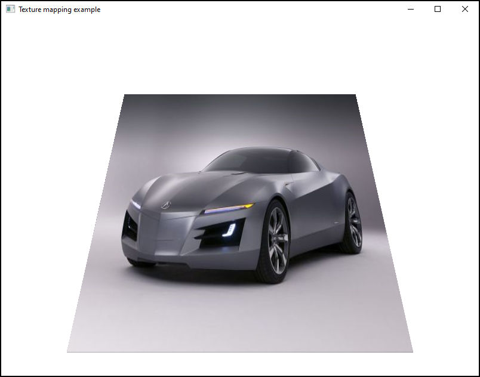

### <a name="_toc101941333"></a>**Наложение текстуры на объемные объекты**

Поскольку визуализация объемного объекта в OpenGL сводится в визуализации плоских граней, аппроксимирующих поверхность данного объекта, принципиальных
отличий от наложения текстуры на плоские объекты нет. Основная наша задача – задать текстурные координаты вершин граней, чтобы получить желаемый
результат.

Рассмотрим в данном примере расчет текстурных координат для сферы и куба, поскольку для таких фигур расчет текстурных координат выполняется достаточно
просто. При наложении текстуры на более сложные объекты автоматический расчет текстурных координат, как правило, слишком сложен или не дает желаемых
результатов. Поэтому дизайнеры трехмерных моделей выполняют наложение текстуры вручную при помощи специальных программ. Данная технология получила
название UV mapping (U и V – распространенное имя для координатных осей в двухмерном текстурном пространстве):

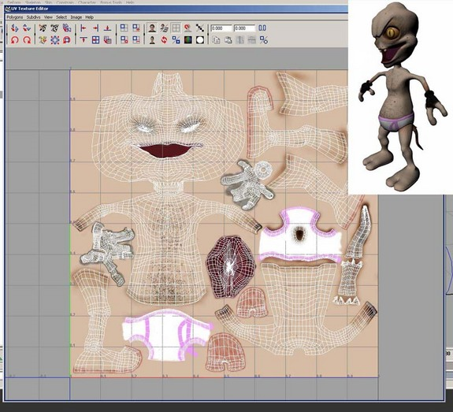

В качестве иллюстрации разработаем приложение, визуализирующее планету в космическом пространстве. Планета будет представлена в виде сферы, с
нанесенной на нее текстурой земной поверхности, а изображение окружающего планету пространство будет визуализировано с использованием [Sky box](http://en.wikipedia.org/wiki/Skybox_%28video_games%29), на грани которого нанесено изображение звезд и галактик.


Положение Skybox будет всегда привязано к положению наблюдателя, что создаст иллюзию того, что звезды и галактики бесконечно удалены от наблюдателя,
т.к. при любом изменении позиции камеры будут равномерно удалены от него.

#### ***Разрабатываем классы для управления текстурными объектами и их загрузки***

Для облегчения управления одно- и двухмерными текстурными объектами разработаем несколько вспомогательных классов. Данные классы возьмут на себя
обязанность по управлению временем жизни текстурных объектов, а также будут призваны упростить некоторые операции над ними.

```cpp
// Базовый текстурный объект – реализует операции, общие для всех текстур
class CBaseTexture
{
public:
    // Генерируем имя для текстурного объекта
    void Create()
    {
        assert(!m_texture);
        glGenTextures(1, &m_texture);
    }

    // Удаляем текстурный объект
    void Delete()
    {
        assert(m_texture);
        glDeleteTextures(1, &m_texture);
        m_texture = 0;
    }

    // Отвязываемся от текстурного объекта и возвращаем его идентификатор
    GLuint Detach()
    {
        GLuint texture = m_texture;
        m_texture = 0;
        return texture;
    }

    // Получаем идентификатор текстурного объекта
    operator GLuint() const
    {
        return m_texture;
    }

    // Делаем объект активным
    void BindTo(GLenum target) const
    {
        assert(m_texture != 0);
        glBindTexture(target, m_texture);
    }

protected:
    CBaseTexture(GLuint texture)
        : m_texture(texture)
    {
    }

    void SetTexture(GLuint texture)
    {
        m_texture = texture;
    }
private:
    GLuint m_texture;
private:
    CBaseTexture(CBaseTexture const&);
    CBaseTexture& operator=(CBaseTexture const&);
};

// Реализация текстурного объекта
// (с управляемым или неуправляемым временем жизни)
// Если параметр t_manager равен true, то время жизни текстурного объекта
// будет привязано к времени жизни экземпляра класса CTextureImpl класса
// Параметр TBase задает тип текстуры
// (одно-, двух-, трехмерная, либо кубическая)
template <bool t_managed, class TBase>
class CTextureImpl : public TBase
{
public:
    CTextureImpl(GLuint texture = 0)
        :TBase(texture)
    {
    }

    ~CTextureImpl()
    {
        bool m = t_managed;
        if (m && (*this != 0))
        {
            TBase::Delete();
        }
    }

    // Присоединяем текстурный объект к экземпляру класса
    void Attach(GLuint texture)
    {
        if (t_managed && (*this != 0) && (texture != *this))
        {
            TBase::Delete();
        }
        TBase::SetTexture(texture);
    }
};

// Реализация двухмерного текстурного объекта
class CTexture2DImpl : public CBaseTexture
{
public:
    CTexture2DImpl(GLuint texture = 0)
        :CBaseTexture(texture){}

    void Bind() const
    {
        BindTo(GL_TEXTURE_2D);
    }

    static void TexImage(
        GLint level,
        GLint internalFormat,
        GLsizei width, GLsizei height,
        GLint border,
        GLenum format, GLenum type,
        const GLvoid* pixels)
    {
        glTexImage2D(GL_TEXTURE_2D, level, internalFormat,
            width, height, border, format, type, pixels);
    }
};

// Реализация одномерного текстурного объекта
class CTexture1DImpl : public CBaseTexture
{
public:
    CTexture1DImpl(GLuint texture = 0)
        :CBaseTexture(texture)
    {
    }

    virtual void Bind() const
    {
        BindTo(GL_TEXTURE_1D);
    }

    static void TexImage(
        GLint level,
        GLint internalFormat,
        GLsizei width,
        GLint border,
        GLenum format, GLenum type,
        const GLvoid * pixels)
    {
        glTexImage1D(GL_TEXTURE_1D, level, internalFormat,
            width, border, format, type, pixels);
    }
};

typedef CTextureImpl<true, CBaseTexture> CTexture;
typedef CTextureImpl<false, CBaseTexture> CTextureHandle;

typedef CTextureImpl<true, CTexture2DImpl> CTexture2D;
typedef CTextureImpl<false, CTexture2DImpl> CTexture2DHandle;

typedef CTextureImpl<true, CTexture1DImpl> CTexture1D;
typedef CTextureImpl<false, CTexture1DImpl> CTexture1DHandle;
```

Для загрузки текстур разработаем класс CTextureLoader, который пока будет осуществлять загрузку лишь двухмерных текстур с использованием GDI+. Данный
класс будет обеспечивать загрузку растровых изображений и присоединение их к новому текстурному объекту, либо к уже существующему. Загруженное
изображение может выступать как в роли одного из уровней детализации, так и в качестве основы для автоматического построения уровней детализации
текстур. Класс будет позволять задавать начальные значения ряда параметров загружаемому текстурному объекту, таких как режим фильтрации текстур и
режим «заворачивания» текстурных координат.

Интерфейс класса представлен ниже.

```cpp
class CTextureLoader
{
public:
    CTextureLoader();

    // Выполняем загрузку двухмерной текстуры из файла
    // Если параметр textureName равен 0, то текстура будет загружена в
    // новый текстурный объект. В противном случае - в существующий
    GLuint LoadTexture2D(
        std::wstring const& fileName,
        GLuint textureName = 0, GLint level = 0) const;

    // Задаем параметры фильтрации при увеличении и уменьшении текстуры,
    // задаваемые сразу после загрузки
    void SetMinFilter(GLenum minFilter);
    void SetMagFilter(GLenum magFilter);

    // определяет, должно ли выполняться автоматическое построение
    // дополнительных уровней детализации для текстурного объекта
    void BuildMipmaps(bool buildMipmaps);

    // Устанавливаем режим "заворачивания" текстурных координат
    void SetWrapMode(GLenum wrapS, GLenum wrapT);
private:
    bool m_buildMipmaps;
    GLenum m_wrapS;
    GLenum m_wrapT;
    GLenum m_minFilter;
    GLenum m_magFilter;
};
```

Код конструктора класса и методов, конфигурирующих его поведение, представлен ниже и в особых пояснениях не нуждается.

```cpp
CTextureLoader::CTextureLoader()
    : m_buildMipmaps(true)
    , m_minFilter(GL_LINEAR_MIPMAP_LINEAR)
    , m_magFilter(GL_LINEAR)
    , m_wrapS(GL_REPEAT)
    , m_wrapT(GL_REPEAT)
{
}

void CTextureLoader::SetMinFilter(GLenum minFilter)
{
    m_minFilter = m_minFilter;
}

void CTextureLoader::SetMagFilter(GLenum magFilter)
{
    m_magFilter = m_magFilter;
}

void CTextureLoader::BuildMipmaps(bool buildMipmaps)
{
    m_buildMipmaps = buildMipmaps;
}

void CTextureLoader::SetWrapMode(GLenum wrapS, GLenum wrapT)
{
    m_wrapS = wrapS;
    m_wrapT = wrapT;
}
```

Метод CTexture::LoadTexture2D является, по сути, усовершенствованной и более гибкой версией метода CMyApplication::LoadTexture из предыдущего примера.
Изменения выделены темно синим цветом.

```cpp
GLuint CTextureLoader::LoadTexture2D(std::wstring const& fileName, GLuint textureName, GLint level) const
{
    // Загружаем изображение при помощи GDI+
    Gdiplus::Bitmap bmp(fileName.c_str());

    if (bmp.GetLastStatus() != Gdiplus::Ok)
    {
        throw std::runtime_error("Error loading texture file");
    }

    // Определяем формат пикселей для использования
    // с методом Bitmap::Lock и функцией gluBuild2DMipmaps
    Gdiplus::PixelFormat pixelFormat = 0;
    GLint textureFormat = 0;
    GLint colorComponents = 0;
    GLint internalFormat = 0;

    // Есть ли в изображении альфа-канал?
    if ((bmp.GetPixelFormat() & PixelFormatAlpha) != 0)
    {
        colorComponents = 4;
        pixelFormat = PixelFormat32bppARGB;
        textureFormat = GL_BGRA_EXT;
        internalFormat = GL_RGBA;
    }
    else
    {
        colorComponents = 3;
        textureFormat = GL_BGR_EXT;
        pixelFormat = PixelFormat24bppRGB;
        internalFormat = GL_RGB;
    }
    Gdiplus::Rect lockRect(0, 0, bmp.GetWidth(), bmp.GetHeight());

    // Получаем прямой доступ для чтения к данным растрового изображения
    Gdiplus::BitmapData bitmapData;
    bitmapData.Scan0 = NULL;
    bmp.LockBits(&lockRect,
        Gdiplus::ImageLockModeRead, pixelFormat, &bitmapData);

    // Создаем текстурный объект (при необходимости)
    CTexture2DHandle texture(textureName);
    if (textureName == 0)
    {
        texture.Create();
    }
    // делаем активным текстурный объект с данным идентификатором
    // (с ним еще пока не связано никакое изображение)
    texture.Bind();

    if (m_buildMipmaps)
    {
        // Строим семейство мип-уровней для загруженного изображения
        // и присоединяем их к выбранному текстурному объекту
        gluBuild2DMipmaps(
            GL_TEXTURE_2D,
            colorComponents,
            bitmapData.Width, bitmapData.Height,
            textureFormat, GL_UNSIGNED_BYTE,
            bitmapData.Scan0);
    }
    else
    {
        // Задаем изображение для заданного уровня детализации
        texture.TexImage(
            level, // Уровень детализации
            internalFormat,
            bitmapData.Width, bitmapData.Height,
            0, // ширина рамки
            textureFormat,
            GL_UNSIGNED_BYTE,
            bitmapData.Scan0);
    }

    // Задаем параметры фильтрации текстуры,
    glTexParameteri(GL_TEXTURE_2D, GL_TEXTURE_MIN_FILTER, m_minFilter);
    glTexParameteri(GL_TEXTURE_2D, GL_TEXTURE_MAG_FILTER, m_magFilter);

    // а также параметры "заворачивания" текстурных координат
    glTexParameteri(GL_TEXTURE_2D, GL_TEXTURE_WRAP_S, m_wrapS);
    glTexParameteri(GL_TEXTURE_2D, GL_TEXTURE_WRAP_T, m_wrapT);

    // Завершаем работу с данными растра
    bmp.UnlockBits(&bitmapData);

    // Возвращаем идентификатор созданного изображения
    return texture;
}
```

#### ***Наложение текстуры на сферу***

Рассмотрим процесс наложения текстуры на сферу. Сама сфера представлена в виде многогранника, вершины которого находятся в точках пересечения
параллелей и меридианов (см. рисунок).


В полярной системе координат каждая точка на сфере радиуса R может быть вычислена по двум углам α и φ следующим образом.

Зная угол φ можно вычислить координату z и радиус окружности, расположенной на -ой параллели:

$$ z=Rsin(φ) $$

$$ r=Rcos(φ) $$

Координаты x и y можно вычислить, зная радиус соответствующей параллели, а также угол α.

$$ x=rcos(α) $$

$$ y=rsin(α) $$

Текстурные координаты вычисляются еще проще:

$$ s=\frac{α}{2π} $$

$$ t=\frac{φ}{2π} $$

Разработаем класс **CSphere**, выполняющий построение сферы с использованием данных формул.

```cpp
class CSphere
{
public:
    CSphere(float radius, unsigned slices, unsigned stacks);
    ~CSphere();
    
    void Draw() const;
private:
    void DrawSphere() const;

    // Идентификатор дисплейного списка, выполняющего рисование сферы
    mutable GLuint m_displayList;
    float m_radius; // радиус
    unsigned m_slices; // количество меридианов
    unsigned m_stacks; // количество параллелей
}
```

Конструктор класса не делает ничего особенного – только инициализирует переменные.

```cpp
CSphere::CSphere(
    float radius,
    unsigned slices,
    unsigned stacks)
    : m_radius(radius)
    , m_slices(slices)
    , m_stacks(stacks)
    , m_displayList(0)
{
}
```

В методе Draw осуществим проверку, был ли создан дисплейный список, хранящий команды рисования сферы. В том случае, если сфера еще не была нарисована,
создаем новый дисплейный список и визуализируем сферу. Сфера визуализируется при помощи лент из треугольников.

В деструкторе данный дисплейный список будет уничтожен.

```cpp
#define M_PI 3.14159265358979323846

/*
Рисуем сферу при помощи последовательности triangle strip-ов
Каждая лента соответствует линии параллелей
*/
void CSphere::DrawSphere() const
{
    // шаг по параллелям
    const float stackStep = static_cast<float>(std::numbers::pi / m_stacks);

    // шаг по меридианам
    const float sliceStep = static_cast<float>(2 * std::numbers::pi / m_slices);

    // начальный угол по параллелям
    for (unsigned stack = 0; stack < m_stacks; ++stack)
    {
        float stackAngle = static_cast<float>(std::numbers::pi * 0.5 - stack * stackStep);
        float nextStackAngle = stackAngle - stackStep;

        const float stackRadius = m_radius * cosf(stackAngle);
        const float nextStackRadius = m_radius * cosf(nextStackAngle);
        const float z0 = m_radius * sinf(stackAngle);
        const float z1 = m_radius * sinf(nextStackAngle);

        glBegin(GL_TRIANGLE_STRIP);
        // цикл по меридианам
        for (unsigned slice = 0; slice <= m_slices; ++slice)
        {
            // вычисляем угол, текущего меридиана
            float sliceAngle = (slice != m_slices) ? slice * sliceStep : 0;

            // Вычисляем координаты на текущей параллели
            float x0 = stackRadius * cosf(sliceAngle);
            float y0 = stackRadius * sinf(sliceAngle);
            // вычисляем и задаем вектор нормали, текстурные координаты
            // и положение вершины в пространстве
            CVector3f normal0(x0, y0, z0);
            normal0.Normalize();
            glNormal3fv(normal0);
            glTexCoord2f(float(slice) / m_slices, float(stack) / m_stacks);
            glVertex3f(x0, y0, z0);

            float x1 = nextStackRadius * cosf(sliceAngle);
            float y1 = nextStackRadius * sinf(sliceAngle);
            CVector3f normal1(x1, y1, z1);
            normal1.Normalize();
            glNormal3fv(normal1);
            glTexCoord2f(float(slice) / m_slices, float(stack + 1) / m_stacks);
            glVertex3f(x1, y1, z1);
        }
        glEnd();
    }
}

CSphere::~CSphere()
{
    if (m_displayList)
    {
        glDeleteLists(m_displayList, 1);
    }
}

void CSphere::Draw() const
{
    if (!m_displayList)
    {
        m_displayList = glGenLists(1);
        glNewList(m_displayList, GL_COMPILE);

        DrawSphere();

        glEndList();
    }
    glCallList(m_displayList);
}
```

Пример сферы, построенной при помощи данного класса (в режиме визуализации полигонов GL_LINE) представлен на следующем рисунке.


Далее разработаем класс CPlanet, выполняющий визуализацию планеты. Данный класс будет использовать класс CSphere для построения сферы, а также классы
CMaterial и CTexture2D для задания свойств материала и текстуры планеты.

Планета будет характеризоваться также углом наклона оси вращения, текущим углом поворота вокруг данной оси и скоростью вращения.

```cpp
class CPlanet
{
public:
    CPlanet(
        std::wstring const& textureName,
        float radius = 1, float slices = 50,
        float stacks = 25);

    // Анимируем планету (вращение вокруг своей оси)
    void Animate(float timeDelta);

    // рисуем планету
    void Draw() const;

    // Угол наклона оси вращения
    void SetInclinationAngle(float inclinationAngle);

    // Скорость вращения вокруг своей оси
    void SetRotationSpeed(float rotationSpeed);

private:
    CSphere m_sphere; // сфера, аппроксимирующая поверхность планеты
    CMaterial m_material; // материал планеты
    float m_rotationAngle; // угол поворота вокруг своей оси
    float m_inclinationAngle; // угол наклона оси вращения
    float m_rotationSpeed; // Скорость вращения вокруг собственной оси
    mutable CTexture2D m_texture; // текстура планеты
    std::wstring m_textureName; // имя файла с текстурой
};
```

Реализация методов класса CPlanet представлена ниже:

```cpp
#include "Planet.h"
#include "TextureLoader.h"

CPlanet::CPlanet(std::wstring const& textureName, float radius, unsigned slices, unsigned stacks)
    : m_sphere(radius, slices, stacks)
    , m_textureName(textureName)
    , m_rotationAngle(0)
    , m_inclinationAngle(0)
    , m_rotationSpeed(0)
{
    m_material.SetDiffuse(1, 1, 1);
    m_material.SetShininess(50);
    m_material.SetSpecular(1, 1, 1);
}

// Изменяем угол вращения планеты вокруг своей оси
void CPlanet::Animate(float timeDelta)
{
    m_rotationAngle =
        fmodf(m_rotationAngle + m_rotationSpeed * timeDelta, 360);
}

void CPlanet::SetInclinationAngle(float inclinationAngle)
{
    m_inclinationAngle = inclinationAngle;
}

void CPlanet::SetRotationSpeed(float rotationSpeed)
{
    m_rotationSpeed = rotationSpeed;
}
void CPlanet::Draw() const
{
    if (!m_texture)
    {
        // Загружаем текстуру при первом вызове метода Draw()
        CTextureLoader loader;
        m_texture.Attach(loader.LoadTexture2D(m_textureName));
    }
    // Активизируем текстуру и материал планеты
    glEnable(GL_TEXTURE_2D);
    m_texture.Bind();
    m_material.Activate();

    // Сохраняем текущую матрицу (предполагается работа с матрицей modelview)
    // и поворачиваем планету
    // (сначала вокруг оси вращения, а затем наклоняем ось)
    glPushMatrix();
    glRotatef(m_inclinationAngle, 1, 0, 0);
    glRotatef(m_rotationAngle, 0, 0, 1);

    // рисуем сферу
    m_sphere.Draw();

    // восстанавливаем текущую матрицу
    glPopMatrix();
}
```

Всего лишь благодаря текстуре наша сфера превратится в планету Земля:


#### ***Добавляем освещение от точечного источника света.***

Улучшить качество визуализации нашей планеты можно, нарисовав ее с учетом освещения от Солнца. В масштабах солнечной системы Солнце уже нельзя считать
направленным источником света. Он, скорее, точечный, равномерно излучающий свет во всех направлениях. Для работы с точечным источником света
разработаем класс **COmniLight**[^1]. Точечный источник света характеризуется своим положением в пространстве (четвертая координата параметра
GL_POSITION равна 1, а не 0, в отличие от направленного), кроме того, для точечного источника можно задать параметры ослабления интенсивности света с
расстоянием. Других отличий от направленного источника света нет. Чтобы устранить дублирование кода между классами COmniLight и CDirectLight вынесем
общий для точечного и направленного источников света код в класс CLight и унаследуем COmniLight и CDirectLight от него.

```cpp
class CLight
{
public:
    virtual void SetLight(GLenum light) const;

    void SetDiffuseIntensity(GLfloat r, GLfloat g, GLfloat b, GLfloat a = 1);
    void SetAmbientIntensity(GLfloat r, GLfloat g, GLfloat b, GLfloat a = 1);
    void SetSpecularIntensity(GLfloat r, GLfloat g, GLfloat b, GLfloat a = 1);

protected:
    CLight();

private:
    GLfloat m_diffuse[4];
    GLfloat m_ambient[4];
    GLfloat m_specular[4];
};

CLight::CLight()
{
    SetDiffuseIntensity(0.8f, 0.8f, 0.8f, 1);
    SetAmbientIntensity(0.2f, 0.2f, 0.2f, 1);
    SetSpecularIntensity(0.5f, 0.5f, 0.5f, 1);
}

void CLight::SetLight(GLenum light) const
{
    glLightfv(light, GL_DIFFUSE, m_diffuse);
    glLightfv(light, GL_AMBIENT, m_ambient);
    glLightfv(light, GL_SPECULAR, m_specular);
}

void CLight::SetDiffuseIntensity(GLfloat r, GLfloat g, GLfloat b, GLfloat a)
{
    m_diffuse[0] = r;
    m_diffuse[1] = g;
    m_diffuse[2] = b;
    m_diffuse[3] = a;
}

void CLight::SetAmbientIntensity(GLfloat r, GLfloat g, GLfloat b, GLfloat a)
{
    m_ambient[0] = r;
    m_ambient[1] = g;
    m_ambient[2] = b;
    m_ambient[3] = a;
}

void CLight::SetSpecularIntensity(GLfloat r, GLfloat g, GLfloat b, GLfloat a)
{
    m_specular[0] = r;
    m_specular[1] = g;
    m_specular[2] = b;
    m_specular[3] = a;
}
```

Класс CDirectLight заметно «похудел», в нем осталась всего пара методов.

```cpp
class CDirectLight : public CLight
{
public:
    CDirectLight(CVector3f const& lightDirection = CVector3f(0, 0, 1));

    void SetDirection(CVector3f const& direction);

    void SetLight(GLenum light) const;
private:
    CVector3f m_direction;
};

CDirectLight::CDirectLight(CVector3f const& lightDirection)
    : m_direction(lightDirection)
{
}

void CDirectLight::SetLight(GLenum light) const
{
    GLfloat lightDirection[4] =
    {
        m_direction.x,
        m_direction.y,
        m_direction.z,
        0
    };
    glLightfv(light, GL_POSITION, lightDirection);
    CLight::SetLight(light);
}

void CDirectLight::SetDirection(CVector3f const& direction)
{
    m_direction = direction;
}
```

Новый класс COmniLight позволяет создавать и настраивать точечные источники света.

```cpp
COmniLight::COmniLight(CVector3f const& position)
    : m_position(position)
    , m_quadraticAttenuation(0)
    , m_linearAttenuation(0)
    , m_constantAttenuation(1)
{
}

void COmniLight::SetLight(GLenum light) const
{
    GLfloat lightPosition[4] =
    {
        m_position.x,
        m_position.y,
        m_position.z,
        1
    };
    glLightfv(light, GL_POSITION, lightPosition);

    glLightf(light, GL_QUADRATIC_ATTENUATION, m_quadraticAttenuation);
    glLightf(light, GL_LINEAR_ATTENUATION, m_linearAttenuation);
    glLightf(light, GL_CONSTANT_ATTENUATION, m_constantAttenuation);

    CLight::SetLight(light);
}

void COmniLight::SetPosition(CVector3f const& position)
{
    m_position = position;
}

void COmniLight::SetQuadraticAttenuation(GLfloat quadraticAttenuation)
{
    m_quadraticAttenuation = quadraticAttenuation;
}

void COmniLight::SetLinearAttenuation(GLfloat linearAttenuation)
{
    m_linearAttenuation = linearAttenuation;
}

void COmniLight::SetConstantAttenuation(GLfloat constantAttenuation)
{
    m_constantAttenuation = constantAttenuation;
}
```

Результат работы программы представлен на рисунке.

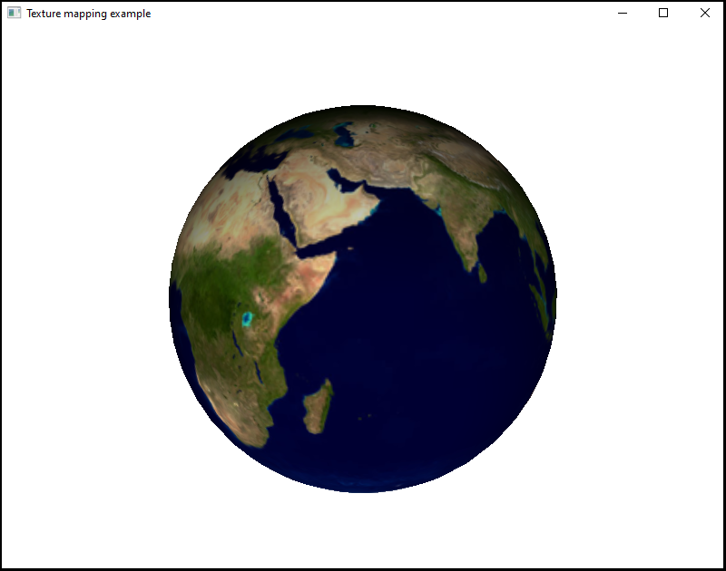

#### ***Наложение текстуры на грани куба***

По условию задачи задний фон должен представлять собой куб, привязанный к точке наблюдения, на грани которого должна быть нанесена текстура звездного
неба.

В качестве текстуры воспользуемся шестью[^2] изображениями звездного неба, найденными на просторах сети Интернет. Данные изображения будут нанесены на
грани Skybox-а.

Для визуализации текстурированного куба разработаем класс CTexturedCube

```cpp
class CTexturedCube
{
public:
    void Draw(GLfloat size = 1) const;
    void SetTextures(
        GLuint leftTexture, GLuint rightTexture,
        GLuint bottomTexture, GLuint topTexture,
        GLuint backTexture, GLuint frontTexture);
private:
    CTexture2D m_backTexture;
    CTexture2D m_frontTexture;
    CTexture2D m_leftTexture;
    CTexture2D m_rightTexture;
    CTexture2D m_bottomTexture;
    CTexture2D m_topTexture;
};

void CTexturedCube::Draw(GLfloat size) const
{
    /*
        Y
        |
        |
        |
        +---X
       /
      /
     Z
       3----2
      /    /|
     /    / |
    7----6  |
    | 0  |  1
    |    | /
    |    |/
    4----5
    */

    // Массив координат вершин
    static const float vertices[8][3] =
    {
        {-1, -1, -1}, // 0
        {+1, -1, -1}, // 1
        {+1, +1, -1}, // 2
        {-1, +1, -1}, // 3
        {-1, -1, +1}, // 4
        {+1, -1, +1}, // 5
        {+1, +1, +1}, // 6
        {-1, +1, +1}, // 7
    };

    struct CubeFace
    {
        unsigned char vertex0;
        unsigned char vertex1;
        unsigned char vertex2;
        unsigned char vertex3;
        GLfloat tex0s, tex0t;
        GLfloat tex1s, tex1t;
        GLfloat tex2s, tex2t;
        GLfloat tex3s, tex3t;
        CTexture2D const& texture;
    };

    // Массив координат граней (в порядке, совпадающем с
    // порядком объявления их в массиве цветов)
    // индексы вершин граней перечисляются в порядке их обхода
    // против часовой стрелки (если смотреть на грань снаружи)
    static const CubeFace faces[] =
    {
        {4, 7, 3, 0, 0, 1, 0, 0, 1, 0, 1, 1, m_leftTexture}, // грань x<0
        {5, 1, 2, 6, 1, 1, 0, 1, 0, 0, 1, 0, m_rightTexture}, // грань x>0
        {4, 0, 1, 5, 0, 1, 0, 0, 1, 0, 1, 1, m_bottomTexture}, // грань y<0
        {7, 6, 2, 3, 0, 0, 1, 0, 1, 1, 0, 1, m_topTexture}, // грань y>0
        {0, 3, 2, 1, 0, 1, 0, 0, 1, 0, 1, 1, m_frontTexture}, // грань z<0
        {4, 5, 6, 7, 0, 0, 1, 0, 1, 1, 0, 1, m_backTexture}, // грань z>0
    };
    static unsigned const faceCount = sizeof(faces) / sizeof(*faces);

    for (unsigned faceIndex = 0; faceIndex < faceCount; ++faceIndex)
    {
        CubeFace const& face = faces[faceIndex];

        face.texture.Bind();

        // Рисуем 4 вершины квадрата
        glBegin(GL_QUADS);
        {
            glTexCoord2f(face.tex0s, face.tex0t);
            CVector3f v0(vertices[face.vertex0]);
            v0 *= size;
            glVertex3fv(v0);

            glTexCoord2f(face.tex1s, face.tex1t);
            CVector3f v1(vertices[face.vertex1]);
            v1 *= size;
            glVertex3fv(v1);

            glTexCoord2f(face.tex2s, face.tex2t);
            CVector3f v2(vertices[face.vertex2]);
            v2 *= size;
            glVertex3fv(v2);

            glTexCoord2f(face.tex3s, face.tex3t);
            CVector3f v3(vertices[face.vertex3]);
            v3 *= size;
            glVertex3fv(v3);
        }
        glEnd();
    }
}

void CTexturedCube::SetTextures(
    GLuint leftTexture, GLuint rightTexture,
    GLuint bottomTexture, GLuint topTexture,
    GLuint backTexture, GLuint frontTexture)
{
    // инициализируем текстурные объекты, соответствующие 6 сторонам куба
    m_leftTexture.Attach(leftTexture);
    m_rightTexture.Attach(rightTexture);
    m_bottomTexture.Attach(bottomTexture);
    m_topTexture.Attach(topTexture);
    m_backTexture.Attach(backTexture);
    m_frontTexture.Attach(frontTexture);
}
```

Для визуализации Sky box разработаем класс CSkyBox, конфигурирующий матрицу ModelView для того, чтобы при любом положении камеры центр куба всегда
совпадал с положением глаза наблюдателя.

```cpp
class CSkyBox
{
public:
    CSkyBox(
        std::wstring const& leftTexture,
        std::wstring const& rightTexture,
        std::wstring const& downTexture,
        std::wstring const& upTexture,
        std::wstring const& backTexture,
        std::wstring const& frontTexture);
    void Draw() const;

private:
    mutable bool m_initialized;
    mutable CTexturedCube m_cube;
    std::wstring m_leftTexture;
    std::wstring m_rightTexture;
    std::wstring m_downTexture;
    std::wstring m_upTexture;
    std::wstring m_backTexture;
    std::wstring m_frontTexture;
};
```

Конструктор класса не нуждается в отдельных комментариях:

```cpp
CSkyBox::CSkyBox(
    std::wstring const& leftTexture,
    std::wstring const& rightTexture,
    std::wstring const& downTexture,
    std::wstring const& upTexture,
    std::wstring const& backTexture,
    std::wstring const& frontTexture)
    : m_initialized(false)
    , m_leftTexture(leftTexture)
    , m_rightTexture(rightTexture)
    , m_downTexture(downTexture)
    , m_upTexture(upTexture)
    , m_backTexture(backTexture)
    , m_frontTexture(frontTexture)
{
}
```

Код метода CSkyBox::Draw требует пояснений.

Во-первых, рисование куба мы будем выполнять, предварительно отключив модификацию буфера глубины при помощи
функции [glDepthMask](http://msdn.microsoft.com/en-us/library/dd318833\(v=VS.85\).aspx)(GL_FALSE) при отключенном тесте глубины. Благодаря этому
содержимое буфера глубины после рисования sky box останется неизменным, при этом все фрагменты куба пройдут тест глубины. По этой же причине sky box
должен быть нарисован первым, чтобы не стереть нарисованные до него объекты.

Во-вторых, центр куба привязан к точке наблюдателя. Это значит, что какой бы мы размер стороны куба ни выбрали, картинка не будет зависеть от длины
стороны куба. Для того чтобы привязать точку наблюдения к точке наблюдателя, необходимо заполнить нулями первые три элемента в четвертом столбце
матрицы моделирования-вида.

В-третьих, здесь мы используем режим оборачивания текстурных координат **GL_CLAMP_TO_EDGE_EXT**, который благодаря стараниям[^3] Microsoft
доступен в системе Windows

```cpp
/*
Режим оборачивания текстурных координат, при котором
при выходе текстурной координаты фрагмента за пределы диапазона 0-1,
используется значение пикселя на ближайшем ребре текстурного изображения.
Данные режим отсутствует в заголовочных файлах OpenGL 1.1, поставляемых с
Visual Studio, но доступен в виде расширения и поддерживается в
настоящее время всеми современными видеокартами
*/
#ifndef GL_CLAMP_TO_EDGE_EXT
#define GL_CLAMP_TO_EDGE_EXT 0x812F
#endif

void CSkyBox::Draw() const
{
    if (!m_initialized)
    {
        CTextureLoader loader;
        // Устанавливаем режим "заворачивания" текстурных координат,
        // обеспечивающие минимальную видимость стыков на гранях куба
        loader.SetWrapMode(GL_CLAMP_TO_EDGE_EXT, GL_CLAMP_TO_EDGE_EXT);

        m_cube.SetTextures(
            loader.LoadTexture2D(m_leftTexture),
            loader.LoadTexture2D(m_rightTexture),
            loader.LoadTexture2D(m_downTexture),
            loader.LoadTexture2D(m_upTexture),
            loader.LoadTexture2D(m_backTexture),
            loader.LoadTexture2D(m_frontTexture));
        m_initialized = true;
    }
    // Устанавливаем необходимые режимы визуализации куба
    glEnable(GL_TEXTURE_2D);
    glDisable(GL_DEPTH_TEST);
    glDepthMask(GL_FALSE);

    // сохраняем текущую матрицу
    glPushMatrix();

    // Положение камеры располагается в 4 столбце матрицы (элементы 12-14)
    // Если занести туда 0, то матрица станет матрицей вращения.
    GLfloat modelView[16];
    glGetFloatv(GL_MODELVIEW_MATRIX, modelView);
    modelView[12] = modelView[13] = modelView[14] = 0;
    glLoadMatrixf(modelView);

    // рисуем куб
    m_cube.Draw();

    // восстанавливаем текущую матрицу
    glPopMatrix();

    glDepthMask(GL_TRUE);
    glEnable(GL_DEPTH_TEST)
}
```

#### ***Разрабатываем вспомогательные классы для поддержки анимации и взаимодействия с пользователем***

Разработаем несколько классов, которые облегчили бы нам вращение камеры вокруг объектов при помощи мыши, а также анимацию трехмерных объектов.

Одним из таких классов будет CRotationController, методы которого будут реализовывать функционал по обработке событий от мыши и применения
трансформации вращения к матрице моделирования-вида.

Исходный код класса представлен ниже. В целом, ничего в нем сложного нет. Мы просто вынесли код, отвечающий за вращение, из класса CMyApplication.

```cpp
/*
Вспомогательный класс для управления вращением объектов при помощи мыши
*/
class CRotationController
{
public:
    CRotationController(int windowWidth, int windowHeight);

    // Возвращает состояние левой кнопки мыши
    bool LeftButtonIsPressed() const;
    // Данный метод нужно вызывать при изменении размеров окна
    void ResizeWindow(int windowWidth, int windowHeight);
    // Данный метод нужно вызывать при нажатии/отпускании кнопки мыши
    void OnMouse(int button, int state, int x, int y);
    // Данный метод нужно вызывать при перемещении мыши
    void OnMotion(int x, int y);

private:
    static void NormalizeModelViewMatrix(void);
    static void RotateCamera(GLfloat rotateX, GLfloat rotateY);
    bool m_leftButtonPressed;
    int m_mouseX;
    int m_mouseY;
    int m_windowWidth;
    int m_windowHeight;
};

CRotationController::CRotationController(int windowWidth, int windowHeight)
    : m_leftButtonPressed(false)
    , m_windowWidth(windowWidth)
    , m_windowHeight(windowHeight)
{
}

void CRotationController::ResizeWindow(int windowWidth, int windowHeight)
{
    m_windowWidth = windowWidth;
    m_windowHeight = windowHeight;
}

void CRotationController::OnMouse(int button, int state, int x, int y)
{
    // Событие от левой кнопки мыши
    if (button == GLUT_LEFT_BUTTON)
    {
        // Сохраняем состояние левой кнопки мыши
        m_leftButtonPressed = (state == GLUT_DOWN);
        // Сохраняем координаты мыши
        m_mouseX = x;
        m_mouseY = y;
    }
}

void CRotationController::OnMotion(int x, int y)
{
    // Если нажата левая кнопка мыши
    if (m_leftButtonPressed)
    {
        // Вычисляем смещение курсора мыши
        int dx = x - m_mouseX;
        int dy = y - m_mouseY;

        // Вычисляем угол поворота вокруг осей Y и X как линейно зависящие
        // от смещения мыши по осям X и Y
        GLfloat rotateX = GLfloat(dy) * 180 / m_windowHeight;
        GLfloat rotateY = GLfloat(dx) * 180 / m_windowWidth;

        RotateCamera(rotateX, rotateY);

        // Сохраняем текущие координаты мыши
        m_mouseX = x;
        m_mouseY = y;
    }
}

// Вращаем камеру вокруг начала координат на заданный угол
void CRotationController::RotateCamera(GLfloat rotateX, GLfloat rotateY)
{
    // Извлекаем текущее значение матрицы моделирования-вида
    GLfloat modelView[16];
    glGetFloatv(GL_MODELVIEW_MATRIX, &modelView[0]);

    // Извлекаем направления координатных осей камеры в 3д пространстве
    // как коэффициенты строк матрицы моделирования-вида
    CVector3f xAxis(modelView[0], modelView[4], modelView[8]);
    CVector3f yAxis(modelView[1], modelView[5], modelView[9]);

    // Поворачиваем вокруг осей x и y камеры
    glRotatef(rotateX, xAxis.x, xAxis.y, xAxis.z);
    glRotatef(rotateY, yAxis.x, yAxis.y, yAxis.z);

    // В ходе умножения матриц могут возникать погрешности, которые,
    // накапливаясь могут сильно искажать картинку
    // Для их компенсации после каждой модификации матрицы моделирования-вида
    // проводим ее ортонормирование
    NormalizeModelViewMatrix();
}

// Производим ортонормирование матрицы моделирования-вида
void CRotationController::NormalizeModelViewMatrix(void)
{
    GLfloat modelView[16];
    glGetFloatv(GL_MODELVIEW_MATRIX, modelView);

    /*
    Ортонормирование - приведение координатных осей к
    единичной длине (нормирование)
    и взаимной перпендикулярности (ортогонализация)
    Достичь этого можно при помощи нормализации координатных осей
    и векторного произведения
    */
    CVector3f xAxis(modelView[0], modelView[4], modelView[8]);
    xAxis.Normalize();
    CVector3f yAxis(modelView[1], modelView[5], modelView[9]);
    yAxis.Normalize();

    // Ось Z вычисляем через векторное произведение X и Y
    // Z будет перпендикулярна плоскости векторов X и Y
    CVector3f zAxis = Cross(xAxis, yAxis);
    // И иметь единичную длину
    zAxis.Normalize();
    // То же самое проделываем с осями x и y
    xAxis = Cross(yAxis, zAxis);
    xAxis.Normalize();
    yAxis = Cross(zAxis, xAxis);
    yAxis.Normalize();

    // Сохраняем вектора координатных осей обратно в массив
    modelView[0] = xAxis.x; modelView[4] = xAxis.y, modelView[8] = xAxis.z;
    modelView[1] = yAxis.x; modelView[5] = yAxis.y, modelView[9] = yAxis.z;
    modelView[2] = zAxis.x; modelView[6] = zAxis.y, modelView[10] = zAxis.z;

    // И загружаем матрицу моделирования-вида
    glLoadMatrixf(modelView);
}

bool CRotationController::LeftButtonIsPressed() const
{
    return m_leftButtonPressed;
}
```

Использовать данный класс очень просто. Достаточно просто вызывать методы данного класса из обработчиков соответствующих событий в классе
CMyApplication.

```cpp
void CMyApplication::OnReshape(int width, int height)
{
    glViewport(0, 0, width, height);

    m_rotationController.ResizeWindow(width, height);

    // Вычисляем соотношение сторон клиентской области окна
    double aspect = double(width) / double(height);

    glMatrixMode(GL_PROJECTION);
    glLoadIdentity();
    gluPerspective(FIELD_OF_VIEW, aspect, ZNEAR, ZFAR);
    glMatrixMode(GL_MODELVIEW);
}

void CMyApplication::OnMouse(int button, int state, int x, int y)
{
    // Событие от левой кнопки мыши
    m_rotationController.OnMouse(button, state, x, y);
}

void CMyApplication::OnMotion(int x, int y)
{
    // Если нажата левая кнопка мыши
    if (m_rotationController.LeftButtonIsPressed())
    {
        m_rotationController.OnMotion(x, y);

        // Инициируем перерисовку окна
        PostRedisplay();
    }
}
```

Следующий вспомогательный класс, который нам понадобится, будет облегчать нам работу по замеру временных интервалов между кадрами.

```cpp
class CAnimationController
{
public:
    CAnimationController();

    // Выполняет сброс контроллера
    void Reset();
    // Данный метод следует вызывать в начале каждого кадра
    void Tick();
    // Возвращает промежуток времени (в мс), прошедший с момента
    // предыдущего кадра
    DWORD GetTimeDelta() const;

private:
    DWORD m_lastTick;
    DWORD m_delta;
};

CAnimationController::CAnimationController()
{
    Reset();
}

void CAnimationController::Reset()
{
    m_lastTick = GetTickCount64();
    m_delta = 0;
}

void CAnimationController::Tick()
{
    DWORD currentTick = GetTickCount64();
    m_delta = currentTick - m_lastTick;
    m_lastTick = currentTick;
}

DWORD CAnimationController::GetTimeDelta() const
{
    return m_delta;
}
```

Для использования данного класса достаточно вызывать его метод Tick с заданной периодичностью и использовать метод **GetTimeDelta** для определения
интервала, прошедшего с момента предыдущего кадра. Для этих целей вполне подойдет обработчик **OnIdle** класса CMyApplication, вызываемый библиотекой
GLUT всякий раз, когда приложение находится в состоянии ожидания событий (т.е. ничего не делает).

```cpp
void CMyApplication::OnIdle()
{
    m_animationController.Tick();
    m_earth.Animate(static_cast<float>(m_animationController.GetTimeDelta() * 0.001));
    PostRedisplay();
    Sleep(10);
}
```

#### ***Собираем компоненты приложения воедино***

Объединим использование разработанных нами компонентов воедино в классе CMyApplicaiton.

```cpp
class CMyApplication : public CGLApplication
{
public:
    CMyApplication(const char * title, int width, int height);

protected:
    virtual void OnInit();
    virtual void OnDisplay();
    virtual void OnIdle();
    virtual void OnReshape(int width, int height);
    virtual void OnMouse(int button, int state, int x, int y);
    virtual void OnMotion(int x, int y);
    virtual void OnKeyboard(unsigned char key, int x, int y);

private:
    // Рисуем космос
    void DrawSkyBox() const;
    // Рисуем землю
    void DrawEarth() const;
    // Угол обзора по вертикали
    static const double FIELD_OF_VIEW;

    // Расстояние до ближней и дальней плоскостей отсечения
    static const double ZNEAR;
    static const double ZFAR;

    // Режим визуализации граней
    // (переключается при помощи клавиши Пробел)
    GLenum m_polygonMode;

    // Контроллеры вращения и анимации
    CRotationController m_rotationController;
    CAnimationController m_animationController;

    // Точечный источник света
    COmniLight m_light;

    // Земля и куб
    CPlanet m_earth;
    CSkyBox m_skyBox;
};
```

В конструкторе класса выполним инициализацию планеты, небесного куба, источника света и других вспомогательных объектов.

```cpp
CMyApplication::CMyApplication(const char* title, int width, int height)
    : CGLApplication(title, width, height)
    , m_earth(L"earth.png")
    , m_rotationController(width, height)
    , m_light(CVector3f(0, 10, 0))
    , m_skyBox(
        L"Galaxy_LT.png",
        L"Galaxy_RT.png",
        L"Galaxy_DN.png",
        L"Galaxy_UP.png",
        L"Galaxy_BK.png",
        L"Galaxy_FT.png")
    , m_polygonMode(GL_FILL)
{
    m_light.SetDiffuseIntensity(1, 1, 1);
    m_light.SetSpecularIntensity(1, 1, 1);
    m_earth.SetRotationSpeed(30);
    m_earth.SetInclinationAngle(23.5);
}
```

Следующие методы выполняют предварительную настройку OpenGL и визуализацию космоса и Земли.

```cpp
void CMyApplication::OnInit()
{
    glEnable(GL_DEPTH_TEST);
    glClearColor(1, 1, 1, 1);
    gluLookAt(0, 2, 1, 0, 0, 0, 0, 0, 1);
}

void CMyApplication::OnDisplay()
{
    glClear(GL_COLOR_BUFFER_BIT | GL_DEPTH_BUFFER_BIT);

    // Включаем режим наложения текстуры
    glEnable(GL_TEXTURE_2D);

    glPolygonMode(GL_FRONT_AND_BACK, m_polygonMode);

    DrawSkyBox();
    DrawEarth();
}

void CMyApplication::DrawEarth() const
{
    glEnable(GL_LIGHTING);
    glEnable(GL_LIGHT0);
    m_light.SetLight(GL_LIGHT0);
    glEnable(GL_CULL_FACE);
    m_earth.Draw();
}

void CMyApplication::DrawSkyBox() const
{
    glDisable(GL_LIGHTING);
    // Отключим режим отбраковки граней, т.к.
    // мы находимся внутри куба и видим его нелицевую сторону
    glDisable(GL_CULL_FACE);
    m_skyBox.Draw();
}
```

Добавим обработчик событий клавиатуры, в котором будем переключаться между режимами визуализации граней (GL_FILL, GL_LINE, GL_POINT) при нажатии на
пробел.

```cpp
void CMyApplication::OnKeyboard(unsigned char key, int /*x*/, int /*y*/)
{
    if (key == ' ')
    {
        if (m_polygonMode == GL_FILL)
        {
            m_polygonMode = GL_LINE;
        }
        else if (m_polygonMode == GL_LINE)
        {
            m_polygonMode = GL_POINT;
        }
        else // polygon mode == GL_POINT
        {
            m_polygonMode = GL_FILL;
        }
        PostRedisplay();
    }
}
```

Ну вот, планета готова.

 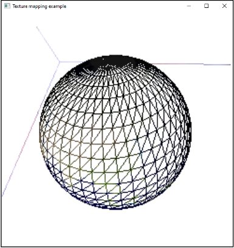 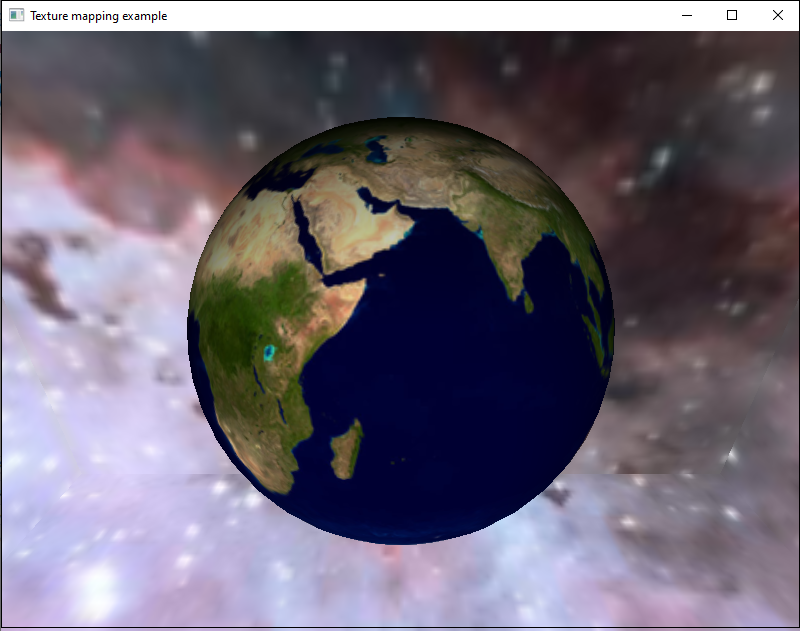

## <a name="_toc101941334"></a>**Наложение тумана**

OpenGL позволяет накладывать туман на выводимые примитивы. При этом цвет фрагмента смешивается с цветом тумана с использованием коэффициента
смешивания, зависящего от расстояния от фрагмента до наблюдателя.

В OpenGL коэффициент смешивания может быть рассчитан одним из следующих образов:

Линейный: 
$$ a=\frac{end-z}{end-start} $$

Экспоненциальный: 
$ f=e^{(-dz)} $

Квадратичный экспоненциальный: 
$ b={e^{(-dz)}}^{2} $

Здесь d – коэффициент плотности тумана, z – глубина фрагмента, start – глубина, начиная с которой туман начинает примешиваться к цвету фрагмента,
end – глубина, на которой цвет фрагмента полностью равен цвету тумана.

Коэффициент f приводится к диапазону от 0 до 1. На его основе результирующий цвет фрагмента вычисляется по следующей формуле:

$$ Сr'=fСr+(1-f)Сf $$

Сr – цвет фрагмента, Сf – цвет тумана

Для того чтобы включить наложение тумана, необходимо вызвать функцию glEnable с параметром GL_FOG.

Для управления параметрами тумана служит семейство функций [glFog](http://msdn.microsoft.com/en-us/library/dd373535\(v=VS.85\).aspx), позволяющих
задать цвет тумана, плотность, начальную и конечную дистанцию для линейного тумана.

### <a name="_toc101941335"></a>**Приложение, демонстрирующее наложение тумана**

Разработаем приложение, иллюстрирующее наложение тумана на трехмерный чайник. Для этого нам понадобится:

- Точечный[^4] источник света
- Материал, из которого сделан чайник
- Контроллер для вращения чайника

Все необходимые классы у нас для этого есть.

Класс главного окна приложения:

```cpp
class CMyApplication : public CGLApplication
{
public:
    CMyApplication(const char * title, int width, int height);

protected:
    virtual void OnInit();
    virtual void OnDisplay();
    virtual void OnReshape(int width, int height);
    virtual void OnMotion(int x, int y);
    virtual void OnMouse(int button, int state, int x, int y);
    virtual void OnKeyboard(unsigned char key, int x, int y);
private:
    // Угол обзора по вертикали
    static const double FIELD_OF_VIEW;

    // Расстояние до ближней и дальней плоскостей отсечения
    static const double ZNEAR;
    static const double ZFAR;

    COmniLight m_light;
    CMaterial m_teapotMaterial;
    CRotationController m_rotationController;
    bool m_fogEnabled;
};
```

Конструктор и обработчик OnInit() выполняют настройку материалов и источника света

```cpp
CMyApplication::CMyApplication(const char* title, int width, int height)
    : CGLApplication(title, width, height)
    , m_light(CVector3f(10, 10, 10))
    , m_rotationController(width, height)
    , m_fogEnabled(true)
{
    m_light.SetDiffuseIntensity(1, 1, 1, 1);
    m_light.SetAmbientIntensity(0.2f, 0.2f, 0.2f, 1);
    m_light.SetSpecularIntensity(1, 1, 1, 1);

    m_teapotMaterial.SetDiffuse(0.8f, 0.6f, 0.8f);
    m_teapotMaterial.SetAmbient(0.4f, 0.3f, 0.4f);
    m_teapotMaterial.SetSpecular(1, 1, 1);
    m_teapotMaterial.SetShininess(30);
}

void CMyApplication::OnInit()
{
    glEnable(GL_DEPTH_TEST);
    glClearColor(1, 1, 0.5, 1);

    gluLookAt(3, 0, 0, 0, 0, 0, 0, 0, 1);
}
```

Теперь остается только включить и настроить туман и нарисовать чайник. Для рисования чайника воспользуемся функцией **glutSolidTeapot** библиотеки
GLUT. В обработчике OnKeyboard мы будем включать и выключать туман по нажатию клавиши «пробел».

```cpp
void CMyApplication::OnDisplay()
{
    glClear(GL_COLOR_BUFFER_BIT | GL_DEPTH_BUFFER_BIT);

    // Включаем либо выключаем туман
    if (m_fogEnabled)
    {
        glEnable(GL_FOG);
    }
    else
    {
        glDisable(GL_FOG);
    }

    // Задаем режим тумана
    glFogi(GL_FOG_MODE, GL_EXP2);

    // Задаем цвет тумана
    float fogColor[4] = {1, 1, 0.5, 1};
    glFogfv(GL_FOG_COLOR, fogColor);

    // и его плотность
    glFogf(GL_FOG_DENSITY, 0.4f);

    // Включаем освещение и рисуем чайник
    glEnable(GL_LIGHTING);
    glEnable(GL_LIGHT0);
    m_light.SetLight(GL_LIGHT0);
    m_teapotMaterial.Activate();

    // Рисуем чайник
    glutSolidTeapot(1);
}

void CMyApplication::OnKeyboard(unsigned char key, int /*x*/, int /*y*/)
{
    if (key == ' ')
    {
        m_fogEnabled = !m_fogEnabled;
        PostRedisplay();
    }
}
```

Результат работы программы представлен на следующем рисунке:

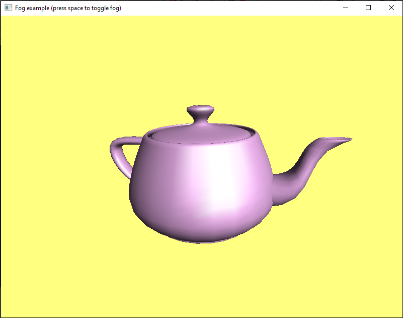 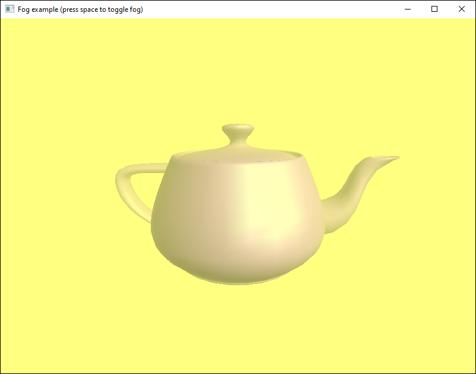

Сравнение изображений чайника с туманом (справа) и без.

## <a name="_toc101941336"></a>**Мультитекстурирование**

Мультитекстурирование – возможность, появившаяся в OpenGL 1.3, которая позволяет накладывать на примитив две или более[^5] текстур одновременно. Это
может быть полезным для таких технологий как [Shadow mapping](http://en.wikipedia.org/wiki/Shadow_mapping)[^6], Detail
textures[^7], [Environment mapping](http://en.wikipedia.org/wiki/Environment_mapping) [^8]и других. Кроме того, дополнительные текстуры могут нести
дополнительную информацию о поверхности (например, информация о неровностях) и использоваться фрагментными шейдерами для создания различных эффектов.

Мультитекстурирование работает следующим образом. Реализация OpenGL поддерживает несколько текстурных модулей (texture unit), в каждом из которых
может быть выбран свой текстурный объект, включено или выключено наложение текстуры, а также установлен режим наложения текстуры (texture environment
mode). Кроме того, текстурные координаты вершины указываются для каждого текстурного модуля отдельно.

Для того чтобы изменить параметры текстурного модуля, приложение должно сделать его активным при помощи
функции [glActiveTexture](https://registry.khronos.org/OpenGL-Refpages/gl4/html/glActiveTexture.xhtml)[^9]. Последующие функции, управляющие наложением текстуры
будут производиться для активного текстурного модуля.

После определения цвета фрагмента путем интерполяции цветов вершин примитива OpenGL выполняет наложение текстуры на фрагмент из каждого текстурного
модуля, вычисляя результирующий цвет фрагмента по исходному цвету фрагмента, цвету соответствующего фрагмента текстуры и режима наложения текстуры.
При этом цвет, полученный на выходе текстурного модуля №0, является исходным цветом для наложения текстуры в текстурном модуле №1, и т.д.

Режим наложения текстуры устанавливается в текущем текстурном модуле при помощи
функций [glTexEnv](https://registry.khronos.org/OpenGL-Refpages/gl2.1/xhtml/glTexEnv.xml). Последние версии OpenGL поддерживают довольно большое количество режимов
наложения текстуры. На рисунке представлено лишь несколько часто используемых режимов.


С использованием фрагментных шейдеров программист может еще более гибко управлять формированием цвета отдельных фрагментов с использованием языка
программирования шейдеров GLSL. Но об этом мы поговорим в одной из ближайших лабораторных работ.

### <a name="_toc101941337"></a>**Работа с расширениями**

Поскольку официальная поддержка OpenGL для системы Windows была остановлена компанией Microsoft на версии 1.1, мультитекстурирование, а также функции
OpenGL последних версий доступны при помощи **механизма расширений** OpenGL.

Приложение может запросить список доступных расширений (в виде строки, содержащей названия расширений, разделенные пробелами) при помощи
функции [glGetString](http://msdn.microsoft.com/en-us/library/dd373553\(v=VS.85\).aspx) с параметром GL_EXTENSIONS. Если необходимое расширение
присутствует в списке расширений, приложение может использовать вводимые этим расширением именованные константы, а также функции, предварительно
запросив их адрес у OpenGL. В системе Windows для получения адреса функции OpenGL служит
функция [wglGetProcAddress](http://msdn.microsoft.com/en-us/library/dd374386\(v=VS.85\).aspx). Данная функция возвращает адрес функции, используемой с
текущим контекстом OpenGL, по ее имени.

Существуют библиотеки, которые берут на себя рутинные обязанности по проверке доступных расширений OpenGL и получению адресов необходимых функций, что
значительно облегчает жизнь программистам. Одной из таких библиотек является [GLEW](http://glew.sourceforge.net/) – OpenGL Extension Wrangler Library,
легкая в использовании кроссплатформенная библиотека с открытым исходным кодом.

Мы воспользуемся данной библиотекой для разработки приложения иллюстрирующего работу с мультитекстурированием.

### <a name="_toc101941338"></a>**Разрабатываем демонстрационное приложение.**

#### ***Установка библиотеки GLEW***

Для того, чтобы установить библиотеку glew, нужен NuGet. NuGet - это бесплатный пакетный менеджер с открытым исходным кодом, служащий для .NET и .NET Core механизмом совместного использования кода, поддерживаемым Microsoft. NuGet – это замечательный инструмент, позволяющий разработчику легко управлять библиотеками в проектах любого типа.

Для добавления NuGet необходимо в Visual Studio Installer добавить пакет "ASP.NET и разработка веб-приложений", либо выбрать его на вкладке "Отдельные компоненты".


После того, как необходимые добавления скачаются, установите в свой проект пакеты NuGet - nupengl.core


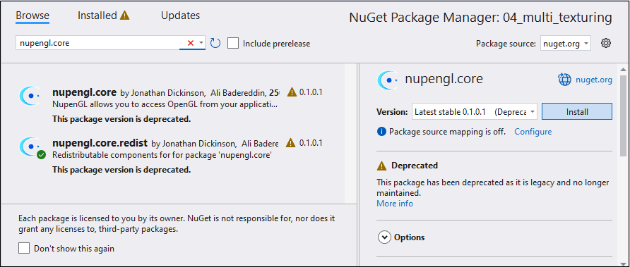

После этого NuGet сам подгрузит нужную нам библиотеку в проект.


#### ***Подключаем библиотеку GLEW к проекту***

Для использования библиотеки GLEW необходимо подключить заголовочный файл **GL/glew.h**, причем до подключения заголовочного файла GL/gl.h. В нашем
примере мы используем библиотеку GLUT, заголовочный файл GL/glut.h которой подключает GL/gl.h. Поэтому GL/glew.h необходимо подключить до GL/glut.h.

```cpp
#define GLEW_STATIC
#include <GL/glew.h>

#include <GL/glut.h>
#include <gdiplus.h>
```

#### ***Инициализация библиотеки GLEW***

Прежде чем использовать библиотеку GLEW, нужно выполнить ее инициализацию, при которой библиотека выполняет поиск доступных обновлений и настройку на
работу с ними.

Инициализация выполняется при помощи функции **glewInit**, которую нужно вызвать после того, как был инициализирован и сделан активным контекст
рендеринга OpenGL[^10].

После инициализации библиотеки GLEW можно узнать о поддержке того или иного расширения при помощи макроса **GLEW_<имя расширения>**. Например,
узнать, поддерживается ли реализацией расширение GL_ARB_multitexture, можно при помощи макроса **GLEW_ARB_multitexture**.

```cpp
    glewInit();
    // Проверяем наличие расширения GL_ARB_multitexture
    if (!GLEW_ARB_multitexture)
    {
        throw std::runtime_error(
            "GL_ARB_multitexture extension is not supported");
    }
```

#### ***Загружаем текстуры***

Для нашего приложения нам понадобятся четыре файла с текстурами. Например, такие:

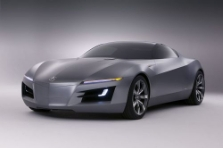
car.jpg


smile.png


Sun.jpg


medved.png (изображение с прозрачными областями)

Для их хранения создадим 3 переменные в классе CMyApplication.

```cpp
class CMyApplication : public CGLApplication
{
public:
    CMyApplication(const char * title, int width, int height);

protected:
    virtual void OnInit();
    virtual void OnDisplay();
    virtual void OnReshape(int width, int height);
    virtual void OnIdle();

private:
    void DrawRectangle() const;
    // Угол обзора по вертикали
    static const double FIELD_OF_VIEW;

    // Расстояние до ближней и дальней плоскостей отсечения
    static const double ZNEAR;
    static const double ZFAR;
    static const float ROTATION_SPEED;

    CAnimationController m_animationController;
    CTexture2D m_car;
    CTexture2D m_smile;
    CTexture2D m_sun;
    CTexture2D m_medved;

    float m_rotationAngle;
};
```

Загрузку текстур выполним при помощи класса CTextureLoader. Перед загрузкой текстур **sun.png** и **medved.png** установим режим заворачивания
текстурных координат в режим GL_CLAMP_TO_BORDER. При этом, за пределами диапазона [0;1) цвет текстуры будет равен цвету рамки.

```cpp
void CMyApplication::OnInit()
{
    glewInit();
    // Проверяем наличие расширения GL_ARB_multitexture
    if (!GLEW_ARB_multitexture)
    {
        throw std::runtime_error(
            "GL_ARB_multitexture extension is not supported");
    }

    CTextureLoader textureLoader;
    m_car.Attach(textureLoader.LoadTexture2D(L"car.jpg"));
    m_smile.Attach(textureLoader.LoadTexture2D(L"smile.png"));

    textureLoader.SetWrapMode(GL_CLAMP_TO_BORDER, GL_CLAMP_TO_BORDER);
    m_sun.Attach(textureLoader.LoadTexture2D(L"sun.png"));
    m_medved.Attach(textureLoader.LoadTexture2D(L"medved.png"));

    glEnable(GL_DEPTH_TEST);
    glClearColor(0.5, 0.5, 0.5, 1);
}
```

#### ***Используем различные режим наложения текстуры***

Код рисования прямоугольника (а точнее, квадрата), претерпел некоторые изменения. Теперь для указания текстурных координат используются
функции [glMultiTexCoord](https://registry.khronos.org/OpenGL-Refpages/gl2.1/xhtml/glMultiTexCoord.xml), с помощью которых мы будем задавать текстурные координаты
вершины для текстурных блоков №0 и №1.

Внимание, как уже говорилось, официальная реализация OpenGL в системе Windows остановилась в своем развитии на версии 1.1, поэтому функции, работающие
с мультитекстурированием, в ней отсутствуют и доступны лишь через механизм расширений. Библиотека GLEW предоставляет вместо этих функций одноименные
макросы, осуществляющие обращение к соответствующим функциям расширений.

Поскольку то или иное расширение может не поддерживаться некоторыми реализациями OpenGL, всегда следует при запуске приложения проверять наличие
необходимых для его работы расширений и при их отсутствии предпринимать адекватные действия. В простейшем случае приложение может просто завершить
свою работу, уведомив пользователя о том, что его реализация OpenGL не поддерживает нужные программе возможности. Однако более дружественным по
отношению к пользователю поведением явилась бы эмуляция отсутствующих возможностей, либо альтернативная визуализация трехмерной сцены без их
использования.

```cpp
void CMyApplication::DrawRectangle() const
{
    /*
    Рисуем прямоугольник, указывая для каждой из его вершин
    текстурные координаты
        Y
        |
    0---|---3
    |   |   |
    |   |   |
    ----+------X
    |   |   |
    |   |   |
    1---|---2
    |
    */
    glBegin(GL_QUADS);
    {
        // верхний левый угол
        glMultiTexCoord2f(GL_TEXTURE0, 0, 0);
        glMultiTexCoord2f(GL_TEXTURE1, 0, 0);
        glVertex3f(-1, 1, 0);

        // нижний левый угол
        glMultiTexCoord2f(GL_TEXTURE0, 0, 1);
        glMultiTexCoord2f(GL_TEXTURE1, 0, 1);
        glVertex3f(-1, -1, 0);

        // нижний правый угол
        glMultiTexCoord2f(GL_TEXTURE0, 1, 1);
        glMultiTexCoord2f(GL_TEXTURE1, 1, 1);
        glVertex3f(1, -1, 0);

        // верхний правый угол
        glMultiTexCoord2f(GL_TEXTURE0, 1, 0);
        glMultiTexCoord2f(GL_TEXTURE1, 1, 0);
        glVertex3f(1, 1, 0);
    }
    glEnd();
}
```

В методе OnDraw сначала включим текстурирование только в текстурном модуле №0 и нарисуем прямоугольник в режиме наложения текстуры GL_MODULATE. В
этом режиме результирующий цвет получается путем умножения соответствующих компонент исходного цвета и цвета текстуры.

```cpp
void CMyApplication::OnDisplay()
{
    glClear(GL_COLOR_BUFFER_BIT | GL_DEPTH_BUFFER_BIT);

    glLoadIdentity();
    gluLookAt(0, -2, 4, 0, 0, 0, 0, 1, 0);

    /*
    Задаем текстуры для текстурного блока №0
    */
    glActiveTexture(GL_TEXTURE0);
    m_car.Bind();

    // Включаем текстурирование только в первом текстурном блоке
    // и рисуем прямоугольник
    {
        glActiveTexture(GL_TEXTURE0);
        glTexEnvi(GL_TEXTURE_ENV, GL_TEXTURE_ENV_MODE, GL_MODULATE);
        glEnable(GL_TEXTURE_2D);

        glActiveTexture(GL_TEXTURE1);
        glDisable(GL_TEXTURE_2D);

        glPushMatrix();

        glTranslatef(-1.5f, 1.5f, 0);
        glColor3f(0.5, 1, 1);

        DrawRectangle();

        glPopMatrix();

    }
```

Результат работы программы показан на рисунке:

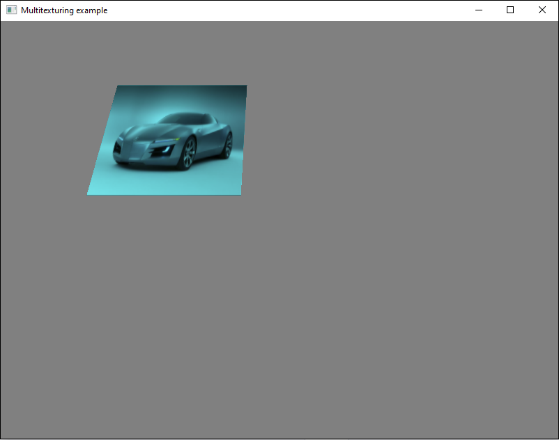

Следующий прямоугольник будет нарисован с использованием двух текстурных модулей. Для второго текстурного модуля будет установлен режим наложения
цвета GL_DECAL, а в качестве второй текстуры будет выступать medved.png.

```cpp
    // Включаем текстурирование в первом и втором текстурных блоках
    // и рисуем прямоугольник
    // Второй текстурный блок работает в режиме GL_DECAL
    {
        glActiveTexture(GL_TEXTURE1);
        glEnable(GL_TEXTURE_2D);
        glTexEnvi(GL_TEXTURE_ENV, GL_TEXTURE_ENV_MODE, GL_DECAL);
        m_medved.Bind();
        glPushMatrix();
        glTranslatef(+1.5f, 1.5f, 0);
        DrawRectangle();
        glPopMatrix();
    }
```

Как видно, в данном режиме произошло наложение цвета второй текстуры только в тех областях, где прозрачность пикселей текстуры отлична от нуля.

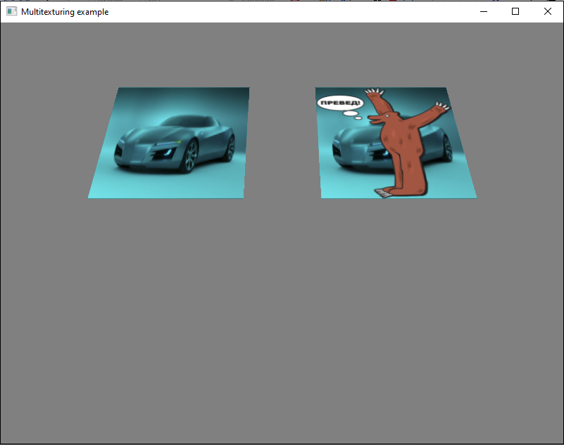

Третий прямоугольник будет нарисован нами с режимом наложения текстуры GL_MODULATE во втором текстурном модуле.

```cpp
    // Включаем текстурирование в первом и втором текстурных блоках
    // и рисуем прямоугольник
    // Второй текстурный блок работает в режиме GL_DECAL
    {
        glActiveTexture(GL_TEXTURE0);
        glEnable(GL_TEXTURE_2D);
        glActiveTexture(GL_TEXTURE1);
        m_smile.Bind();
        glTexEnvi(GL_TEXTURE_ENV, GL_TEXTURE_ENV_MODE, GL_MODULATE);
        glEnable(GL_TEXTURE_2D);
        glPushMatrix();
        glTranslatef(-1.5f, -1.0f, 0);
        DrawRectangle();
        glPopMatrix();
    }
```

Как видно, цвет второй текстуры промодулировал цвет, который был получен на выходе первого текстурного блока.


Для рисования четвертого прямоугольника придется немного потрудиться. Проиллюстрируем независимое использование матрицы преобразования текстурных
координат в текстурном модуле №1, а также режим наложения текстуры GL_ADD.

```cpp
    /*
    Рисуем прямоугольник, применяя к одному из текстурных блоков
    трансформацию текстурных координат
    */
    {
        glActiveTexture(GL_TEXTURE1);
        m_sun.Bind();
        glTexEnvi(GL_TEXTURE_ENV, GL_TEXTURE_ENV_MODE, GL_ADD);
        // сохраняем матрицу ModelView в стеке матриц и переносим
        // прямоугольник вдоль вектора 1.5, -1.0
        glPushMatrix();
        glTranslatef(1.5f, -1.0f, 0);

        // Активируем текстурный блок №1 и задаем для него матрицу
        // трансформации текстурных координат
        glActiveTexture(GL_TEXTURE1);
        glMatrixMode(GL_TEXTURE);
        // сохраняем текущую матрицу в стеке матриц
        // (в каждом текстурном блоке - свой стек матриц)
        glPushMatrix();
        glLoadIdentity();
        // вращаем вокруг оси Z, проходящей через точку (0.5, 0.5, 0)
        glTranslatef(0.5, 0.5, 0);
        glRotatef(m_rotationAngle, 0, 0, 1);
        glTranslatef(-0.5, -0.5, 0);
        DrawRectangle();

        // восстанавливаем матрицы
        glPopMatrix();
        glMatrixMode(GL_MODELVIEW);
        glPopMatrix();
    }
}
```

В конструкторе класса выполним инициализацию переменной m_rotationAngle, хранящей угол поворота текстуры sun.png. Обработчики OnInit будет
осуществлять изменение угла вращения в зависимости от времени с момента прошедшего кадра и скорость вращения.

```cpp
const float CMyApplication::ROTATION_SPEED = 40;

CMyApplication::CMyApplication(const char* title, int width, int height)
    : CGLApplication(title, width, height)
    , m_rotationAngle(0)
{
}

void CMyApplication::OnIdle()
{
    m_animationController.Tick();

    m_rotationAngle +=
        static_cast<float>(m_animationController.GetTimeDelta() * 0.001 * ROTATION_SPEED);
    m_rotationAngle = fmodf(m_rotationAngle, 360);

    Sleep(10);
    PostRedisplay();
}
```

Результат представлен на следующем рисунке.

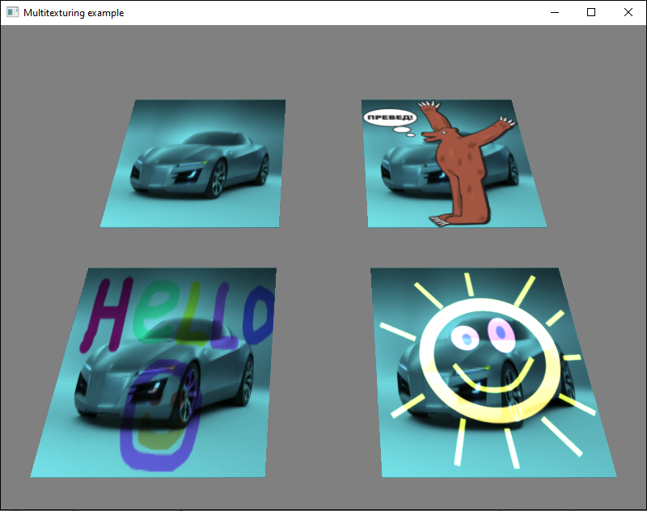

## <a name="_toc101941339"></a>**Практические задания**

На оценку «**удовлетворительно**» набрать не менее 100 баллов.

На оценку «**хорошо**» необходимо набрать не менее 200 баллов

Для получения оценки «**отлично**» необходимо набрать не менее 400 баллов

### <a name="_toc101941340"></a>**Обязательные задания**

#### ***Задание 1***

Разработайте с использованием OpenGL приложение, визуализирующее сцену, соответствующую одному из следующих вариантов.

##### Вариант 1 – Земля + Солнце + Луна – 50 баллов

Программа визуализирует [Землю](http://ru.wikipedia.org/wiki/%D0%97%D0%B5%D0%BC%D0%BB%D1%8F), вращающуюся
вокруг [Солнца](https://ru.wikipedia.org/wiki/%D0%A1%D0%BE%D0%BB%D0%BD%D1%86%D0%B5), а также [Луну](http://ru.wikipedia.org/wiki/%D0%9B%D1%83%D0%BD%D0%B0),
вращающуюся вокруг Земли. Ось вращения Земли наклонена под углом 23,43 градуса. Луна вращается вокруг Земли и **всегда повернута к ней одной своей
стороной**. Для простоты расчетов считать орбиты планет окружностями. Расстояния и относительные размеры планет и Солнца можно в точности не
соблюдать, чтобы не потерять наглядность.

Текстуры планет и Солнца можно взять, например, в программе [Celestia](https://celestiaproject.space/).

Солнце должно быть точечным источником света и освещать Луну и Землю.

###### *Бонус в 10 баллов за управление мышью*

Бонус начисляется за возможность вращения вокруг Солнца при помощи мыши.

###### *Бонус в 10 баллов за задний фон звездного неба*

Бонус начисляется за наличие SkyBox-а с текстурой звездного неба.

##### Вариант 2 – Коттедж – 150 баллов

Программа визуализирует кирпичный коттедж с прилегающими к нему постройками и другими объектами (гараж, забор, крыльцо). В коттедже и гараже должны
иметься окна и хотя бы одна дверь.

На объекты сцены должны быть нанесены соответствующие текстуры (кирпичная кладка, черепица, трава на земле и т.п.).

Необходимо разработать классы, выполняющие визуализацию составляющих частей трехмерной сцены.

В сцене должен присутствовать хотя бы один источник света.


###### *Бонус в 10 баллов за управление мышью*

Бонус начисляется за возможность вращения камеры вокруг дома при помощи мыши

###### *Бонус в 30 баллов за наличие фонарей*

Бонус начисляется за наличие дополнительных конических источников света, представленных в виде стоящих рядом с домом фонарей и освещающих его.

###### *Бонус в 10 баллов за текстуру неба*

Вокруг сцены должен иметься Skybox (или sky sphere) с нанесенной на него текстурой неба, чтобы улучшить визуальные характеристики изображения.

###### *Бонус в 30 баллов за мультитекстурирование*

Бонус начисляется за использование мультитекстурирования для:

- Нанесение дополнительных элементов, например, граффити на стене, мелкие неровности на стенах и т.п.

###### *Бонус в 5 баллов за туман*

Бонус начисляется за визуализацию сцены с использованием тумана. Туман должен включаться или выключаться пользователем при помощи клавиатуры, либо
мыши.

##### Вариант 3 – Компьютерный стол – 70 баллов

Программа визуализирует компьютерный стол, содержащий несколько ящиков. Столешница должна быть непрямоугольной формы (можно аппроксимировать ее при
помощи веера из треугольников). На поверхность стола должна быть нанесена текстура. Стол должен освещаться одним или несколькими источниками света.


###### *Бонус в 10 баллов за управление мышью*

Бонус начисляется за возможность вращения камеры вокруг стола при помощи мыши

##### Вариант 4 – Ракета – 100 баллов

Программа визуализирует космическую ракету. У ракеты должно быть несколько сопел, на поверхность ракеты должна быть нанесена соответствующая
текстура (иллюминаторы, мелкие детали корпуса и т.п.).

Ракета должна освещаться одним или несколькими источниками света.


###### *Бонус в 10 баллов за управление мышью*

Бонус начисляется за возможность вращения камеры вокруг ракеты при помощи мыши.

##### Вариант 5 – Кегля – 50 баллов

Программа визуализирует кеглю для игры в боулинг. На поверхность кегли нанесена текстура, а сама она освещается.


###### *Бонус в 10 баллов за управление мышью*

Бонус начисляется за возможность вращения камеры вокруг кегли при помощи мыши.

##### Вариант 6 – Трехмерный лабиринт – 150 баллов

Программа визуализирует трехмерный лабиринт. На стены лабиринта нанесена текстура. Реализовать в программе не менее 6 типов стен, различающихся
текстурой. Пользователь может передвигаться по лабиринту при помощи мыши и/или клавиатуры. Проходить сквозь стены нельзя.

###### *Бонус в 50 баллов за мультитекстурирование*

Бонус начисляется за наложение карты теней на стены лабиринта. Для этого, вероятно, придется подготовить карту теней в графическом редакторе, либо
найти готовую.

###### *Бонус в 5 баллов за туман*

Бонус начисляется за наложение тумана.

###### *Бонус в 10 баллов за текстуру неба*

Бонус начисляется за наличие Skybox (или Sky sphere) с нанесенной на него текстуру неба.

### <a name="_toc101941341"></a>**Дополнительные задания**

#### ***Задание 2***

##### Вариант 1 – Memory Trainer 3D – 250 баллов

Разработайте игру Memory Trainer 3D. Суть игры заключается в следующем:

Пользователю показывается игровое поле M * N табличек (всего табличек четное число), повернутых к нему оборотной стороной (текстура оборотной стороны
одинакова для всех табличек). При щелчке по плитке она плавно переворачивается (вот поэтому-то в названии игры и используется **3D**) лицевой
стороной, на которой нарисована некоторая картинка. Если до этого была открыта плитка с тем же рисунком, то обе плитки удаляются с поля. В противном
случае обе плитки плавно поворачиваются обратно рубашкой вверх.

Повторный щелчок по ячейке, повернутой к нам картинкой, вызывает ее обратный поворот рубашкой вверх.

Цель игры – убрать все плитки с игрового поля.


Само игровое поле отображается пользователю в перспективе. Плитки должны освещаться и выглядеть объемными.

Для определения места щелчка мыши можно воспользоваться функцией [gluUnProject](http://msdn.microsoft.com/en-us/library/dd374157\(v=VS.85\).aspx),
позволяющей узнать по оконным координатам координаты в системе координат объекта. Спроецировав пару точек, отличающихся лишь оконной координатой z
можно построить прямую, проходящую через данную точку из глаза наблюдателя. Затем останется только найти точку пересечения данной прямой с плоскостью,
в которой располагаются плитки, а по координате на плоскости определить плитку.

###### *Бонус в 40 баллов за мультитекстурирование*

Бонус начисляется за подсветку плиток при наведении мыши – по ним должен «пробегать» блик от дополнительной текстуры (наложение текстуры с бликом
следует делать в режиме GL_ADD).

###### *Бонус в 40 баллов за возможность выбора уровня сложности*

От уровня сложности должен зависеть размер игрового поля, а также количество различных картинок на нем (чем больше уровень сложности, тем
разнообразнее картинки).

##### Вариант 2 – Arcanoid 3D – 300 баллов

Разработайте трехмерный вариант игры [Arcanoid](http://ru.wikipedia.org/wiki/Arkanoid). Игрок может перемещать по горизонтали платформу-ракетку,
используя клавиши управления курсором, подставляя ее под шарик, не давая шарику упасть вниз. На игровом поле находятся разноцветные кирпичики. Удар
шарика по кирпичику приводит к разрушению последнего. Некоторые кирпичики разрушаются только после нескольких попаданий.

После того как все кирпичики будут разрушены происходит переход на следующий уровень с новым набором кирпичиков.

Трехмерный вариант игры отличается от классической версии перспективной проекцией игрового поля, а также трехмерными кирпичиками, битой и шариком. На
кирпичики, шарик, биту и задний фон игрового поля должны быть наложены текстуры, а сами объекты (возможно, кроме заднего фона), освещены одним или
несколькими источниками света.

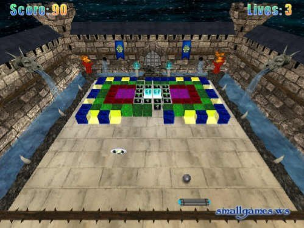

**Рисунок 1 Один из 3D вариантов игры Arcanoid**

###### *Бонус до 200 баллов за реализацию различных бонусов*

Дополнительные баллы присуждаются за реализацию системы бонусов, при которой при разбивании некоторых кирпичиков из них могут падать вниз различные
призы, подхватив который ракеткой пользователь может получить один из следующих бонусов (реализовать можно не все, а только часть данных бонусов):

- Дополнительную жизнь (жизни теряются при падении шарика за нижнюю границу игрового поля)
- Замедление скорости движения шарика. Действие бонуса ограничено по времени.
- Увеличение скорости движения шарика. Действие бонуса ограничено по времени.
- Расширение ракетки, облегчающее процесс ловли шарика. Действие бонуса ограничено по времени.
- Сужение ракетки, затрудняющее процесс ловли шарика. Действие бонуса ограничено по времени.
- Прилипание шарика к ракетке, что позволяет переместить ракетку вместе с прилипшим к ней шариком на нужное место, а потом отцепить шарик от ракетки
  при помощи клавиши «пробел»
- Возможность стрельбы из ракетки (при помощи клавиши «Пробел») по кирпичикам. Действие бонуса ограничено по времени.
- Утроение количества шариков. Шарик распадается на 3 шарика, что ускоряет процесс разрушения кирпичиков и несколько снижает риск потери жизни при
  утрате шарика, т.к. для потери жизни все имеющиеся на экране шарики должны упасть вниз. Действие бонуса по времени не ограничено.

Действие ряда бонусов может прерывать действие некоторых несовместимых с ним ранее пойманных бонусов. Например, прилипание шарика и стрельба из
ракетки могут отменять действие друг друга. Аналогично отменяют действие друг друга бонус «сужение ракетки» и «расширение ракетки», а также «ускорения
шарика» и «замедление шарика».

###### *Бонус до 50 баллов за звуковое сопровождения игры*

Бонус присуждается за реализацию аудио сопровождения игры (фоновая музыка и звуковые эффекты).

[^1]: Omni light – (англ.) ненаправленный источник освещения
[^2]: Можно было бы обойтись и одним большим изображением, внутри которого находятся сразу 6 изображений, либо нанести текстуру звездного неба на
сферу. Любознательному студенту не составит проблем поэкспериментировать с данными способами.

[^3]: А точнее, отсутствию усилий данной компании в развитии OpenGL для платформы Windows, поскольку здесь он конкурирует с их собственной
разработкой, Direct 3D.

[^4]: Если честно, то подойдет любой источник света J

[^5]: Количество текстур зависит от реализации не превышает восьми

[^6]: Shadow mapping – технология, при которой на поверхность объектов в дополнение к основной текстуре накладывается еще и текстура тени.

[^7]: Detail textures – технология по увеличению детализированности поверхности за счет наложения высокочастотной текстуры мелких деталей

[^8]: Environment mapping – технология, при которой на объект с гладкой поверхностью в дополнение к основной текстуре накладывается текстура
окружающей среды (в реальном времени обычно реализовывается с использованием кубических текстур)

[^9]: Или функции glActiveTextureARB расширения GL_ARB_multitexture.

[^10]: При использовании библиотеки GLUT контекст рендеринга создается после создания окна при помощи glutCreateWindow.